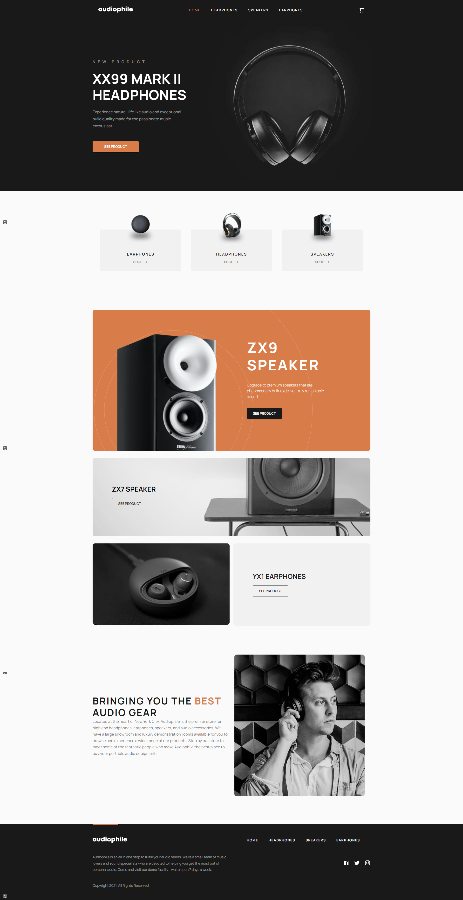

# Frontend Mentor - Audiophile e-commerce website solution

This is a solution to the [Audiophile e-commerce website challenge on Frontend Mentor](https://www.frontendmentor.io/challenges/audiophile-ecommerce-website-C8cuSd_wx). Frontend Mentor challenges help you improve your coding skills by building realistic projects.

## Table of contents

- [Overview](#overview)
  - [The challenge](#the-challenge)
  - [Screenshot](#screenshot)
  - [Links](#links)
  - [Setup](#setup)
- [My process](#my-process)
  - [Built with](#built-with)
  - [What I learned](#what-i-learned)
- [Author](#author)

## Overview

### The challenge

Users should be able to:

- View the optimal layout for the app depending on their device's screen size :heavy_check_mark:
- See hover states for all interactive elements on the page :heavy_check_mark:
- Add/Remove products from the cart :heavy_check_mark:
- Edit product quantities in the cart :heavy_check_mark:
- Fill in all fields in the checkout :heavy_check_mark:
- Receive form validations if fields are missed or incorrect during checkout :heavy_check_mark:
- See correct checkout totals depending on the products in the cart :heavy_check_mark:
  - Shipping always adds $50 to the order :heavy_check_mark:
  - VAT is calculated as 20% of the product total, excluding shipping :heavy_check_mark:
- See an order confirmation modal after checking out with an order summary :heavy_check_mark:
- **Bonus**: Keep track of what's in the cart, even after refreshing the browser (`localStorage` could be used for this if you're not building out a full-stack app) :heavy_check_mark:

### Screenshot

### Links

[Live Site URL](https://audiophile-ecommerce-wheat.vercel.app/)

### Setup

To run this project locally:

npm install && npm start

## My process

### Built with

- React.js
- MAterial UI
- Redux Toolkit
- Formik | Yup validation
- Framer-Motion
- Atomic Design System

### What I learned

#### Material-UI

For this project I wanted for the first time to try out some component library, before I mainly used sass. I decided to go with Material UI, because they create their components with accessibility in mind.
I really recommend it if you are a fan of CSS-in-JS like me.

#### Redux Toolkit

Redux is one of the oldest and most popular state management libraries for React applications, and although currently there are [many alternatives](https://leerob.io/blog/react-state-management) to choose from, in job listings for React positions you will see Redux more often than others.
Redux Toolkit is a library that makes working with Redux a lot easier, as it eliminates a lot of boilerplate. With Redux Toolkit you can create so called slices (pieces of state in your application) that combine action creators and reducers. It automatically sets up Redux DevTools by default.
It also allows you to update state in a 'mutating way' thanks to Immer library it uses under the hood.
In the application I'm using Redux to hold mostly state of cart, persist it to local storage and retrieve it when the app is loaded.  
Dan Abramov, creator of Redux, recommends subscribing to store to persist data to local storage. So that's the approach I followed. You can read more about it [here](https://stackoverflow.com/questions/35305661/where-to-write-to-localstorage-in-a-redux-app).

## Author

- LinkedIn - [Mostafa Ismail](https://www.linkedin.com/in/mostafa-ismail-068169185/)
- Frontend Mentor - [@MostafaIsmaiel](https://www.frontendmentor.io/profile/MostafaIsmaiel)
